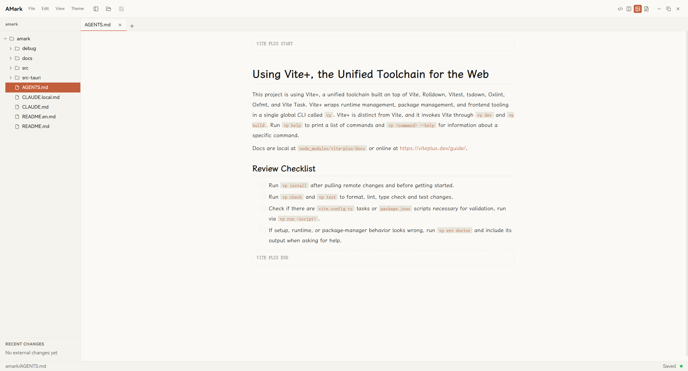
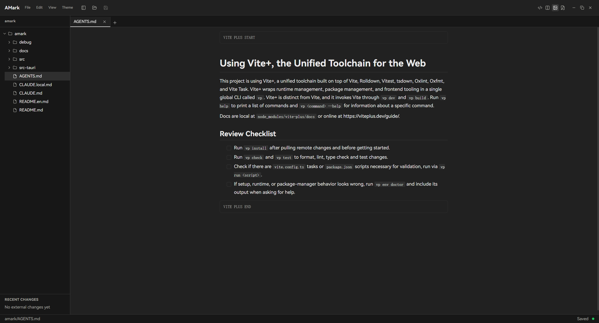

# AMark

**A lightweight, ai agent-native local Markdown editor**

What AI writes deserves a proper reader.

English · [简体中文](./README.md)

## The first reader of agent output

Writing is being handed to agents; reading is still yours.

LLM-generated wikis, local knowledge bases, Claude Code's memory, specs out of OpenSpec, PRDs mid-iteration — these were never single files. They're whole directories: layered, cross-referenced, and continuously rewritten by agents. Plain text isn't a good way to read them: references can't be followed, comments sit raw in the body, and there's no way to tell which files the agent just changed.

AMark is that proper reader:

- The whole directory renders WYSIWYG, and `@path` references jump on click — a folder full of Markdown reads close to a wiki, not a list of isolated files;
- Every agent write appears in the editor live; an activity indicator tells you when it's done, and a recent-changes list shows what it touched this round;
- Even the marks written for agents — `@path` references in CLAUDE.md, block-level HTML comments left in documents — AMark understands: references you can click, comments you can see.

## How you'll use it

**Read LLM wikis & local knowledge bases** — an agent can write an entire knowledge base overnight. Opened as a workspace, you browse along the file tree and follow the references — it finally reads as a whole.

**Review specs, PRDs and plans** — specs from OpenSpec, PRDs mid-iteration, Claude Code's plans: they're directory-shaped by nature. Read them piece by piece, follow the references, with changed files listed in one place by time.

**Watch the agent write** — Claude Code runs in your terminal, AMark sits beside it: documents take shape as they're generated. Orange = writing, green = done — no half-written intermediate states.

**Everyday Markdown editing** — WYSIWYG, local-first, no accounts, no cloud, no noise. Humans still write things themselves, occasionally.

## Features

**Live agent output tracking**

- Workspace-level file watching: the editor refreshes automatically on external writes; rapid write bursts are merged without flicker
- Agent activity indicator: orange pulse = writing, green flash = done
- Recent changes panel: touched files listed by time, click to open

**Multi-file workspace**

- Open a single `.md` file, or a whole folder as a workspace
- Markdown file tree: create / rename / delete files and folders
- Tabs with dirty-state indicators; close others / all / unmodified

**Editing & reading**

- WYSIWYG editing powered by Milkdown, with CommonMark + GFM support
- Four view modes: source / split (synced scrolling) / preview-only / WYSIWYG
- `@path` file references render as clickable chips; Ctrl/Cmd+click jumps to the target file
- Block-level HTML comments render as muted callouts, so notes agents leave behind no longer vanish

**Themes & export**

- 5 built-in themes, plus custom CSS theme import
- PDF / HTML export; rich-text copy pastes cleanly into email and chat apps
- English / Chinese UI, cross-platform desktop app (Windows / macOS / Linux)

## Installation

Download the installer for your platform from the [Releases](../../releases) page:

| Platform | Package         |
| -------- | --------------- |
| Windows  | `.msi` / `.exe` |
| macOS    | `.dmg`          |
| Linux    | `.deb`          |

Once installed, open your project directory with AMark — say, the repo Claude Code is working in, or its memory directory — then go back to your terminal and let the agent keep working.

## Design principles

- **AI Agent Native**: we stay sensitive to how the AI agent ecosystem moves. Today's useful feature can be tomorrow's baggage — AMark adopts new capabilities decisively, and removes outdated ones just as decisively. Small and right beats big and complete.
- **Lightweight**: AMark is built with Tauri, delivering a cross-platform desktop experience while keeping app size and runtime footprint as small as possible.

## Roadmap

- **Search**: quickly find content within the current file and across the workspace.
- **Formula rendering**: render common Markdown math formulas.
- **LaTeX-like typesetting preview**: bring preview-only mode closer to papers and formal documents — justified alignment and similar typesetting — so Markdown works better for long-form reading.
- **More AI Agent Native scenarios**: we're still exploring interactions better suited to reading, reviewing, and collaborating on agent output. If you've found a Markdown workflow that fits especially well with AI agent tools, open an issue and share it.

## License

[MIT](./LICENSE)
